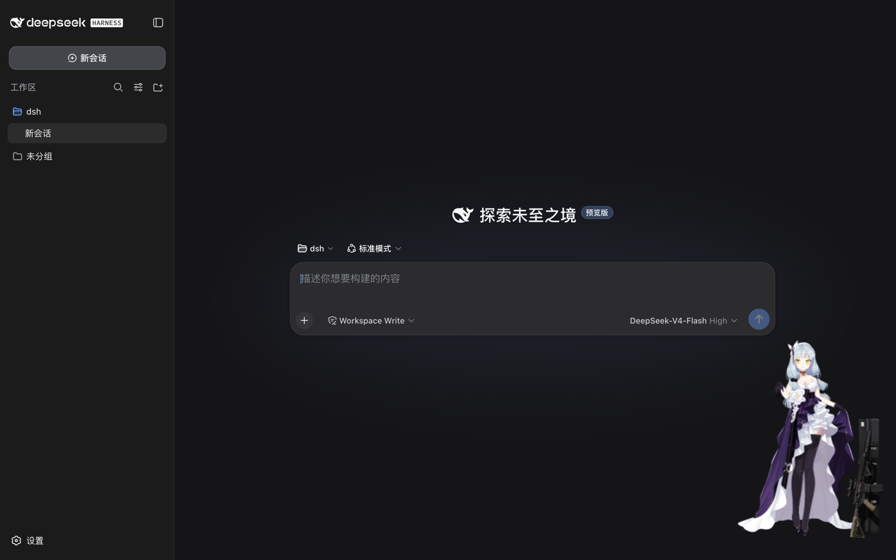
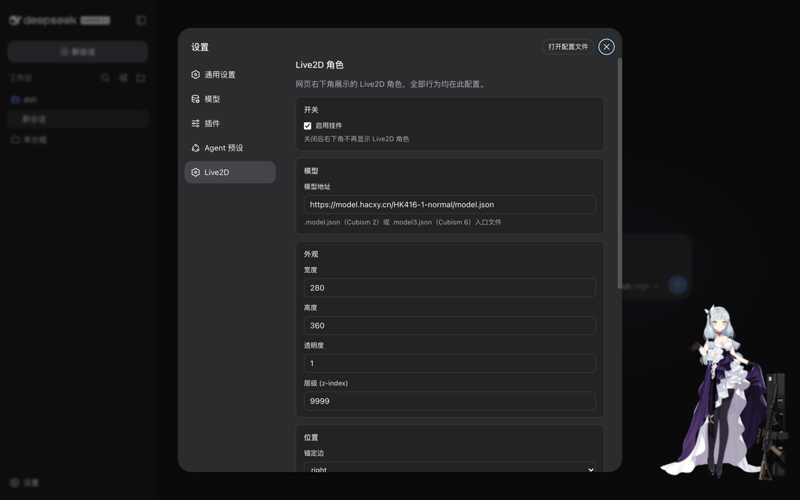

# dsh-live2d

[](https://www.npmjs.com/package/dsh-live2d)
[](https://github.com/hacxy/dsh-live2d/blob/main/LICENSE)

让 [DeepSeek Harness](https://github.com/deepseek-ai/deepseek-harness) 的 Web 界面右下角多一只 Live2D 看板娘——带加载进度条的模型、可以随手拖到任意位置，尺寸、位置、透明度、音量……**全部行为都在 Web 可视化设置界面进行调整**。

<p align="center">
  
</p>

## 特性

- **右下角 Live2D 角色**：默认内置模型（Cubism 6），支持任意 `.model.json`（Cubism 2）与 `.model3.json`（Cubism 6）
- **加载进度条**：模型资源下载时显示进度，加载完成自动隐藏
- **可拖拽**：拖到屏幕任意位置；不想要拖拽也能关
- **全量配置 Web 化**：模型地址、尺寸、位置、锚定边、缩放、透明度、层级、音量、日志级别、总开关——13 个字段全部在「设置 → Live2D」里完成，保存即生效，无需重启、无需改文件
- **跟随主题**：面板配色与 DSH 界面（浅色/深色）自动一致
- **零依赖安装**：l2d 运行时已打进插件包，用户装完即用
- **配置安全**：多开页面/外部修改冲突时自动刷新为最新值，不会静默互相覆盖

## 安装

```sh
dsh plugin --profile web add dsh-live2d
dsh web
```

> 想先本地体验？`git clone` 后在包目录 `pnpm install && pnpm run build`，再
> `dsh plugin --profile web add /path/to/dsh-live2d`，最后 `dsh web`。

## 使用

打开 DSH Web → 左下角侧边栏 → **设置** → **Live2D**。

<p align="center">
  
</p>

| 分组 | 支持配置                             |
| ---- | ------------------------------------ |
| 开关 | 总开关 `enabled`（关闭后不显示角色） |
| 模型 | 模型地址 `modelUrl`                  |
| 外观 | 宽度、高度、透明度、层级             |
| 位置 | 锚定边（右下/左下）、水平/底部间距   |
| 渲染 | 模型缩放、动作音量、日志级别         |
| 交互 | 可拖拽                               |

几点说明：

- **保存即生效**：改完点「保存」，尺寸/位置类改动原地应用，模型地址等改动会自动重载模型，无需重启。
- **恢复默认**：一键清除你的自定义，回到部署默认值。
- **实时同步**：其他标签页或外部对配置文件的修改，会自动热更到所有已打开页面。

## 卸载

```sh
dsh plugin --profile web remove dsh-live2d
```

## 配置（进阶）

插件采用 DSH 官方 settings 通道，「三层解析，后层优先」：

1. schema 默认（内置）
2. base 层：部署者的组合配置（`cordis.patch.yml` 的 `live2d` 行）
3. user 层：`~/.dsh/settings.yaml` 的 `dsh-live2d` 段——由设置面板写入，优先级最高

```yaml
# ~/.dsh/settings.yaml（正常不需要手改，设置面板会代管）
dsh-live2d:
  modelUrl: "https://example.com/model.model3.json"
  width: 320
```

## 开发

```sh
pnpm install
pnpm run typecheck   # tsc --noEmit
pnpm run build       # tsdown → lib/index.mjs（Node 半）+ lib/client.js（浏览器半，l2d 内联）
```

浏览器端到端验证（需先安装进 web profile 并 `dsh web --port 3090` 运行，本机装有 Chrome；headless 软件渲染下请先换成 Cubism 2 模型如 shizuku 再验证画面）：

```sh
"/Applications/Google Chrome.app/Contents/MacOS/Google Chrome" --headless=new \
  --no-sandbox --disable-gpu --enable-unsafe-swiftshader --use-angle=swiftshader-webgl \
  --disable-dev-shm-usage --no-first-run --user-data-dir=/tmp/dsh-chrome \
  --remote-debugging-port=9224 about:blank &

DEBUG_PORT=9224 node scripts/e2e-verify-v2.mjs
```

`scripts/e2e-verify-v2.mjs` 覆盖：默认挂载定位、加载进度条、改模型地址 → 挂件重载、改尺寸/锚定/总开关 → 原地生效，结束后自动恢复默认配置。

### 架构速览

- **Node half**（`src/index.ts`）：Cordis entry，用 `installSettingsSection`（`@deepseek-ai/dsh-settings`）注册 `dsh-live2d` settings namespace，组合配置作 base 层；schema 同时承担持久层校验。
- **Browser half**（`src/client/`）：`__ModuleLoader__` CJS bundle。挂件订阅 `ctx.settingsScope` 快照——布局字段原地更新 DOM（不重载模型），渲染字段重建 l2d；设置面板向官方 `settings.section` 注入全字段表单（逐字段 `set`，恢复默认 `unset`）。

## 免责声明

本插件**不包含、不分发任何 Live2D 模型资源**。默认模型 URL 指向模型 CDN，请确认你有权使用所配置的模型（商用需遵循模型许可与 [Live2D Proprietary Software License](https://www.live2d.com/eula/live2d-proprietary-software-license-agreement_en.html)）。

## License

[MIT](./LICENSE)
